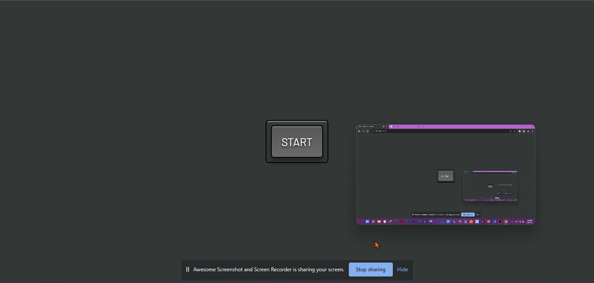

<h1>Picture In Picture</h1>

<h2>A picture in picture site created using HTML, CSS, and JavaScript.</h2>

This webpage created using HTML, CSS, and JavaScript that allows you to get a picture in picture of your screen simply clicking the start button. This site works with Chrome and not FireFox. Screenshot of the website.

- Live Site: [Picture In Picture](https://picture-in-picture-site.netlify.app/)

### Screenshots

